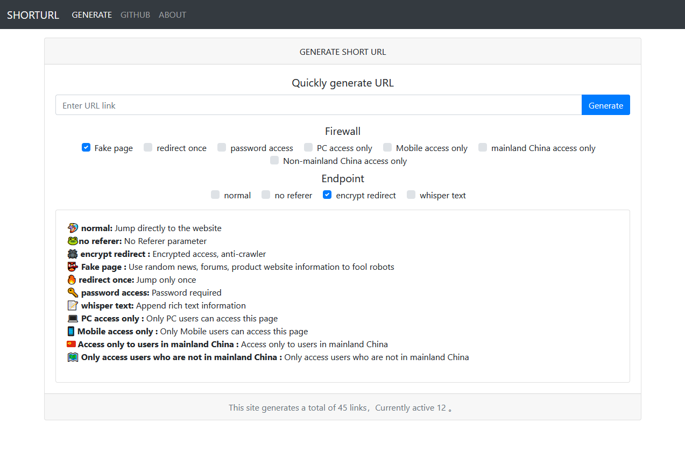

# 🔗PHP轻量短链接

PHP轻量短链接是一个简单而强大的工具，用于生成短链接，并提供多种定制化的功能，使链接管理变得更加灵活和便捷。通过使用这个工具，您可以快速生成短链接，支持API方式和在线网页方式生成。该项目提供了丰富的功能，包括密码访问、附加图文信息、仅限特定地区访问等，以满足不同需求场景的链接管理。


## 体验预览

<https://x007.in/>

[](preview.png)

## 支持功能

- 🌵API快速生成短链接
- 🌱在线网页生成短链接
- 🍄支持Redis、File缓存控制
- 🏄🏼‍♀️ 原始: 直接跳转到目标网站
- 🐸无Referer: 无 Referer 参数，目标网站无法获取来源站地址
- 🕷 加密跳转 : 加密跳转参数信息，反大部分爬虫抓取探测
- 👺 伪装页面 : 使用随机信息、论坛、商品来骗过机器人爬虫
- 🔥 阅后即焚: 一次性跳转(阅后即焚)
- 🔑 密码访问: 将为你生成密码，访问时需要密码验证
- 📝 附加图文: 附加富文本信息，您可以在此留言并分享给您的其他社交媒体用户
- 💻 仅限PC访问
- 📱 仅限手机访问
- 🇨🇳 仅限中国大陆用户访问
- 🗺️ 仅限非中国大陆用户访问


## 安装

采用传统 php 项目方式部署安装，以下介绍两种方式进行部署安装，线上推荐使用 Docker。

### Docker 部署

运行命令之后访问 80 端口即可, 容器内部采用 php-fpm 与 nginx 并行提供服务。

```bash
docker run -d -p 80:80 ellermister/shourturl:latest
```


### 手动安装

**下载本程序到网站根目录**

```bash
php -S 127.0.0.1:12138
```

**访问浏览**

http://127.0.0.1:12138

**nginx 配置**

```nginx
location / {
    try_files $uri $uri/ /index.php?$query_string;
}
```

**二级目录配置**

比如，`/shorturl/`以 `/` 结尾，实际访问 `http://ip/shorturl/`

```php
define('SUB_PATH', '/shorturl/');
```

同样，这里 nginx 要做配置

```nginx
 location /shorturl {
    try_files $uri $uri/ /shorturl/index.php?$query_string;
 }
```


### API

**生成短链接**

```bash
curl -s http://127.0.0.1:12138/api/link?url=https://map.baidu.com/poi/%E4%B9%9D%E9%BE%99%E5%85%AC%E5%9B%AD/@12713897.395906774,2531599.1717763273,15.45z
```

Response

```json
{"msg":"ok","code":200,"data":"http://127.0.0.1:12138/s/aFdlm"}
```
