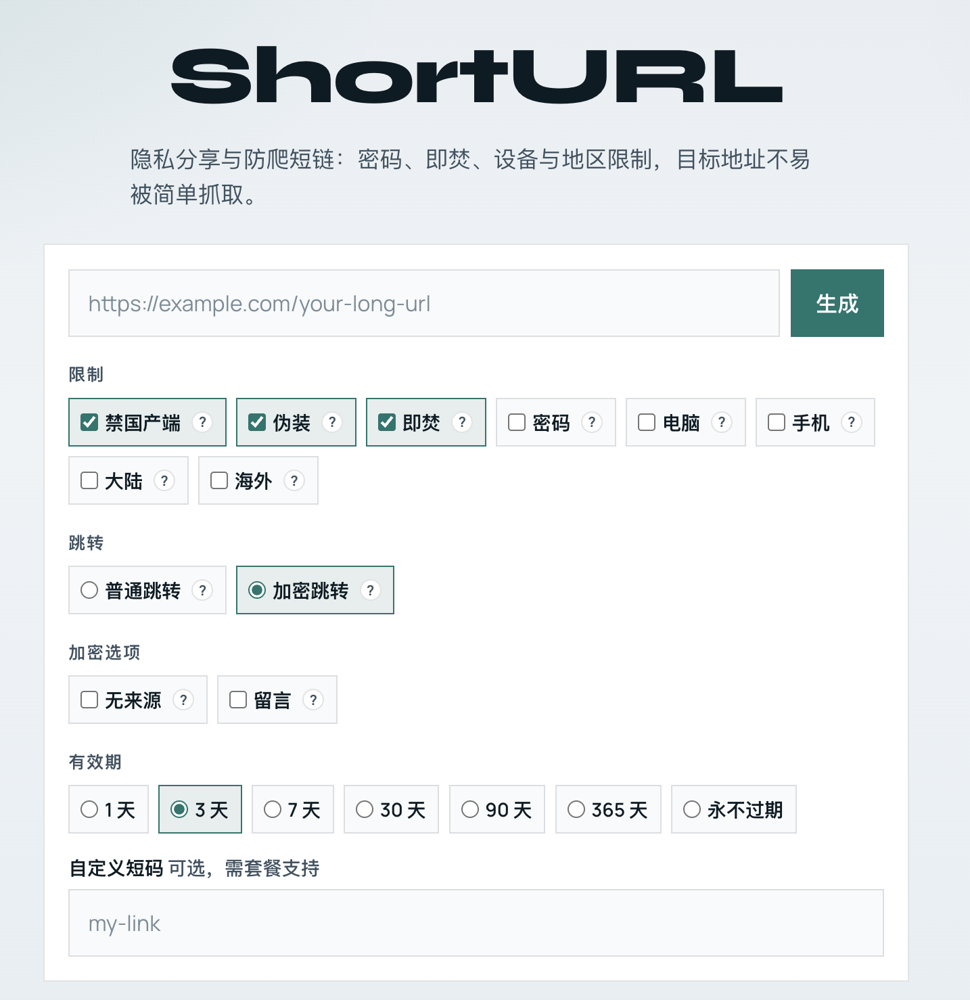

# ShortURL

短链接服务：在网页上一键生成短链，并用密码、阅后即焚、设备 / 地区限制、加密跳转、伪装页等能力，控制「谁能打开、打开多久、跳到哪里」。

适合个人分享、临时交接、以及希望链接更难被简单爬取的场景。

## 在线体验

<https://x007.in/>

[](preview.png)

## 能做什么

### 创建与管理

- 网页生成短链（中 / 英 / 日）
- 开放注册；登录后在「我的」管理自己的短链
- 可按套餐使用：更高创建量、自定义短码、修改目标地址、更长有效期等
- 每条短链可查看访问明细（时间、地区、设备等）

### 跳转方式

- **普通跳转**：检查通过后尽快进入目标站
- **加密跳转**：先挑战校验再出站，真实目标不出现在首屏
- **无来源**：加密跳转时可选择不向目标站发送 Referer
- **留言**：登录后可为链接附带说明，访问者校验通过后先看到再跳转

跳转流程详见 [`加密跳转.md`](加密跳转.md)。

### 隐私与访问限制

- **阅后即焚**：成功跳转一次后失效
- **密码访问**：自定义或自动生成
- **伪装跳转**：爬虫 / 未授权可导向伪装站
- **禁国产端**：可选拦截微信、QQ 等 App 内置浏览器
- 仅限电脑 / 仅限手机
- 仅限中国大陆 / 仅限海外

### 站点运营（管理员）

- 全站统计、短链与用户管理
- 权益套餐与访客创建配额可在后台调整

## 自己部署

推荐用 Docker。启动后打开映射端口即可使用（默认管理员务必改掉）。

```bash
docker run -d \
  --name shorturl \
  -p 80:8080 \
  -v shorturl-data:/app/data \
  -e BASE_URL=https://your.domain \
  -e JWT_SECRET=please-change-me \
  -e ADMIN_USER=admin \
  -e ADMIN_PASS=admin123 \
  -e CORS_ORIGINS=https://your.domain \
  ellermister/shorturl:latest
```

| 项目 | 说明 |
|------|------|
| 镜像 | [`ellermister/shorturl`](https://hub.docker.com/r/ellermister/shorturl) |
| 端口 | 容器内 `8080` |
| 数据 | 卷挂载 `/app/data`（仅 SQLite）；IP 库在镜像内 `/app/share/`，勿与数据卷混放 |
| 管理员 | `ADMIN_USER` / `ADMIN_PASS` |

更多环境变量见 [`server/.env.example`](server/.env.example)。接口与开发说明见 [`server/README.md`](server/README.md)。

### 快速调用 API

未登录也可创建（受访客配额限制）：

```bash
curl -s -X POST http://127.0.0.1:8080/api/v1/links \
  -H 'Content-Type: application/json' \
  -d '{"url":"https://example.com","features":["encrypt","fake_page"]}'
```

## License

[MIT](LICENSE)
