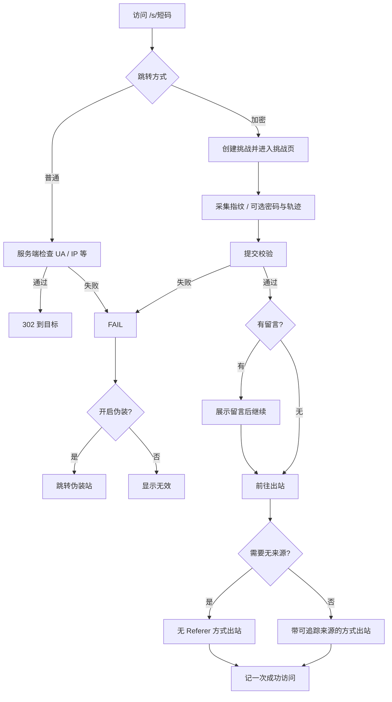

# 跳转说明：普通跳转与加密跳转

ShortURL 支持两种跳转方式。本文面向使用者与接入方，说明能力边界与访问流程（不涉及实现排期或历史迁移）。

---

## 1. 两种跳转方式

| 方式 | 用户体验 | 特点 |
|------|----------|------|
| **普通跳转** | 打开短链后尽快进入目标站 | 服务端环境检查通过后直接 `302`；目标会出现在响应的 `Location` 中 |
| **加密跳转** | 先进入挑战页，通过后再出站 | 真实目标不出现在首屏；可配合密码、留言、无来源、行为校验等 |

创建时二选一。加密跳转下可额外勾选 **无来源**（剥离 Referer）；普通跳转的纯 `302` 无法做到这一点。

---

## 2. 创建时可配合的能力

### 访问限制（可多选，互斥项除外）

| 限制 | 说明 |
|------|------|
| 禁国产端 | 拦截微信、QQ 等常见 App 内置浏览器 |
| 仅大陆 / 仅海外 | 按访问 IP 归属（ip2region） |
| 仅电脑 / 仅手机 | 按 UA 与设备信号（加密跳转还会参考浏览器指纹） |

互斥：`仅大陆` ↔ `仅海外`；`仅电脑` ↔ `仅手机`。

### 加密跳转专属

| 能力 | 说明 |
|------|------|
| 密码 | 挑战页输入后校验 |
| 留言 | 需登录创建；校验通过后先展示留言，再继续出站 |
| 无来源 | 出站时不向目标站发送 Referer |
| 行为校验 | 指纹、可选鼠标轨迹等参与判定；开启「停用缓存」等调试态可能导致挑战失败 |

### 失败与生命周期

| 能力 | 说明 |
|------|------|
| 伪装 | 失败时跳到公共伪装站，而不是暴露真实目标 |
| 不伪装 | 失败时表现为链接无效（如 404） |
| 有效期 | 到期后无法再访问 |
| 阅后即焚 | 仅 **成功出站一次** 后失效；挑战失败、密码错误、伪装跳 **不消耗** 次数 |

---

## 3. 用户访问流程（概览）

要点：

- 入口始终是 `GET /s/{code}`。
- 加密跳转：挑战通过后，浏览器再访问出站地址完成跳转；**成功出站前不会把目标 URL 放进首屏页面**。
- 未勾选「无来源」时，出站会尽量让目标站看到来自本站短链落地页的来源信息；勾选后则剥离 Referer。

---

## 4. 加密跳转分步（给接入 / 运维）

| 步骤 | 路径 | 作用 |
|------|------|------|
| 1. 入口 | `GET /s/{code}` | 环境粗筛后进入挑战流程（前端挑战页） |
| 2. 拉取挑战 | `GET /api/v1/challenge/{id}` | 取得种子与是否需要密码等公开信息 |
| 3. 校验 | `POST /api/v1/challenge/verify` | 校验密码、指纹、环境等；成功后下发短时 Cookie 与一次性凭证（可含留言） |
| 4. 出站 | `GET /j/{code}?sig=…&n=…` | 核销凭证后跳转目标；按配置决定是否无 Referer |

约定：

- 挑战与出站凭证均为短时、一次性；过期或用过后需重新打开短链。
- 校验与出站响应均避免缓存敏感内容。
- 响应中 **不会** 直接返回明文目标 URL 给挑战页展示。

---

## 5. 对照与预期

| | 普通跳转 | 加密跳转 |
|--|----------|----------|
| 首跳 | 直接 302 | 挑战页 |
| 目标是否易被首屏看到 | `Location` 可见 | 仅最终出站时出现 |
| 密码 / 留言 / 无来源 | 不适用或很弱 | 支持 |
| 设备判断 | 主要靠 UA | UA + 指纹等 |

**能挡住什么**：简单 curl、不会跑完整浏览器挑战的爬虫、随手开着「停用缓存」的调试访问（启发式）。

**挡不住什么**：完整驱动真实浏览器并人工/脚本点「继续」的对手。加密跳转提高探测成本，不是绝对保密。

单机部署时，挑战等短时状态保存在进程内；进程重启后未完成的挑战会失效，用户重新打开短链即可。
